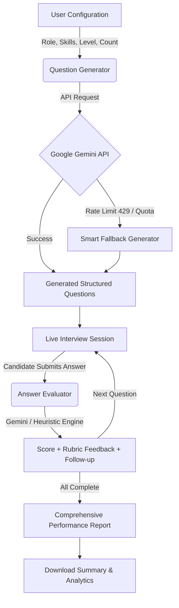

# 🎯 AI-Based Interview Question Generator & Assessment Platform

An intelligent, full-featured technical interview simulation and assessment engine. Built with **Streamlit** and powered by **Google Gemini AI**, the platform generates tailored technical questions, conducts interactive candidate interview sessions, objectively evaluates answers against multi-criteria rubrics, and compiles in-depth analytical performance reports.

---

## 🌟 Key Features

- **🧠 Role-Specific Question Generation**:
  - Dynamically creates customized questions across multiple domains: Frontend, Backend, Full Stack, ML/AI, DevOps, Data Analysis, and Custom roles.
  - Supports 5 experience levels (*Fresher*, *0-1 yrs*, *1-3 yrs*, *3-5 yrs*, *5+ yrs*) and 3 difficulty tiers (*Easy*, *Medium*, *Hard*).
  - Flexible question categories: *Technical*, *Conceptual*, *Scenario-Based*, *Problem Solving*, and *Behavioral*.

- **⚡ High-Speed Google Gemini Integration with Free-Tier Resiliency**:
  - Configured for high-performance free-tier Gemini models: `gemini-2.0-flash`, `gemini-1.5-flash`, `gemini-1.5-flash-8b`, `gemini-2.0-flash-lite`, and `gemini-2.5-flash`.
  - **Intelligent Quota / Rate-Limit Fallback**: If an unpaid Gemini API key hits its free-tier rate limit (HTTP 429) or quota exhaustion, the engine automatically switches to a built-in dynamic question template and heuristic evaluator so the interview proceeds without interruption.

- **💬 Interactive Live Interview Simulation**:
  - Sequential, one-question-at-a-time interview pacing to simulate a real interview room.
  - Real-time response capture, answer review tabs, and automated follow-up probing questions based on candidate answers.

- **⚖️ Objective Rubric-Based Evaluation**:
  - Strict 0–10 scoring based on concrete technical criteria.
  - Generates clear breakdowns of demonstrated technical strengths (`correct_points`), omissions (`missing_points`), concise feedback, and actionable improvement steps.

- **📊 Comprehensive Analytics & Executive Reports**:
  - Detailed score metrics (percentage, performance tier, topic mastery breakdown).
  - Identifies weak topics and recommends targeted revision areas.
  - Exportable report summary for candidates and hiring managers.

- **🛡️ Zero-Database Architecture**:
  - Pure session-state memory management with no external database dependencies (zero SQL/NoSQL overhead).

---

## 🏗️ System Architecture & Workflow



---

## 📁 Project Structure

```text
HCL/
├── app.py                      # Main Streamlit application and multi-page UI
├── services/
│   ├── __init__.py             # Service package exports
│   ├── question_generator.py   # Gemini API caller & dynamic question generator
│   ├── evaluator.py            # Rubric-based answer evaluation service
│   ├── report_generator.py     # Analytics & report calculation engine
│   └── answer_evaluator.py     # Alternative OpenAI evaluation service
├── tests/
│   └── test_qa_suite.py        # 12-point automated unit & integration test suite
├── .env.example                # Template for environment variables
├── requirements.txt            # Python package dependencies
├── .gitignore                  # Git ignore rules
└── README.md                   # Project documentation
```

---

## 🚀 Getting Started

### Prerequisites
- **Python 3.10+** installed on your system.
- A **Google Gemini API Key** (available for free at [Google AI Studio](https://aistudio.google.com/)).

### 1. Clone & Navigate to Project
```powershell
cd "c:\Users\SACHIN VERMA\OneDrive\Desktop\HCL"
```

### 2. Set Up Virtual Environment (Optional but Recommended)
```powershell
# Create virtual environment
python -m venv .venv

# Activate on Windows (PowerShell)
.\.venv\Scripts\Activate.ps1

# Activate on Linux/macOS
source .venv/bin/activate
```

### 3. Install Dependencies
```powershell
pip install -r requirements.txt
```

### 4. Configure API Key
Create a `.env` file in the project root (or copy from `.env.example`):
```ini
GEMINI_API_KEY=your_actual_gemini_api_key_here
```
*(You can also use `GOOGLE_API_KEY` or `OPENAI_API_KEY` as fallback variable names).*

### 5. Launch the Application
```powershell
streamlit run app.py
```
After running, open your browser and navigate to:
👉 **[http://localhost:8501](http://localhost:8501)**

---

## 🧪 Running the Test Suite

The project includes an automated test suite verifying 12 key system components:
1. Application Startup & Constants Integrity
2. Interview Configuration Dictionary Generation
3. Input Boundary & Edge Case Validation
4. LLM Question Generation & Rubric Scaling
5. Invalid JSON Response Handling & Self-Repair
6. Candidate Empty/Whitespace Answer Submissions
7. AI Evaluation Logic & Score Clamping (0 to Max)
8. Follow-up Question Tracking
9. Score Calculation & Percentage Accuracy
10. Final Report Metrics & Topic Breakdown
11. State Reset & Session Clearing
12. Zero-Database Constraint Verification

Run the test suite using:
```powershell
python -m unittest tests/test_qa_suite.py -v
```

---

## ⚙️ Configuration Options

| Parameter | Options / Format | Description |
| :--- | :--- | :--- |
| **Job Role** | Frontend, Backend, Full Stack, Python, ML, DevOps, Data Analyst, Custom | Sets domain context for question targeting |
| **Experience** | Fresher, 0-1 yrs, 1-3 yrs, 3-5 yrs, 5+ yrs | Calibrates difficulty and technical depth |
| **Skills** | Python, FastAPI, React, SQL, Docker, TypeScript, etc. + Custom | Focuses specific tools and libraries |
| **Interview Type**| Technical, Behavioral, Coding, System Design, Mixed | Determines question structure and style |
| **Difficulty** | Easy, Medium, Hard | Scales rubric strictness and scenario depth |
| **Question Count**| 5 to 15 questions | Controls interview length |

---

## 📄 License
This project is licensed under the MIT License.
